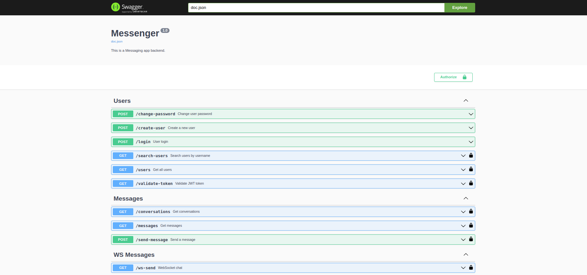

# How to Run This Go Backend Project

## Prerequisites
- [Go](https://go.dev/dl/) installed (version 1.23.0+ recommended)
- [Air](go install github.com/air-verse/air@latest) installed for hot reloading (optional but recommended)

## Steps

1. **Clone the repository**

```bash
git clone https://github.com/Dexterlente/messagebe.git
cd go-backend
go mod download

```
2. **Run the project**

To start with hot reload using Air (run this in the root directory):
```bash
air
```
3. ***Test the routes***

go to browser to check the documentation of different routes
``` http://localhost:5000/swagger/index.html ```



```bash
go-backend/
│
├── cmd/
│   └── app/
│       └── main.go            # Entry point of the application
├── config/                    # Configuration loading and management
├── internal/                  # Core internal packages for the application
│   ├── controllers/           # Handles HTTP requests and responses (API Layer)
│   ├── services/              # Business logic layer
│   ├── repositories/          # Data access layer, interacts with the database
│   ├── models/                # Structs and types representing your data models
│   ├── middlewares/           # HTTP middleware functions
│   ├── utils/                 # Utility functions, helpers (e.g., string manipulation, date formatting)
│   ├── validators/            # Input validation logic
├── migrations/                # Database migration files (SQL or migration tool files)
├── pkg/                       # Shared libraries or utilities (e.g., auth, logging, caching)
├── test/                      # Unit and integration tests
└── go.mod                     # Module dependencies
```
